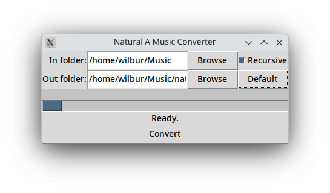

# Natural A music converter

This program converts an entire folder of music from 440Hz A to 432Hz A by slowing it down just a bit.

It runs in Python 3 (officially written in Python 3.13 to be exact), and depends on the following non-native Python packages:
- [AudioOP-LTS](https://pypi.org/project/audioop-lts/)
- [PyDub](https://pypi.org/project/pydub/)
- [Mutagen](https://pypi.org/project/mutagen/)

It also depends on the external program [FFmpeg](https://ffmpeg.org/) for non-WAV audio formats.

A bundled executable with the Python dependencies is available in the releases page of this repository, but if you plan to convert non-WAV files, you will have to install FFmpeg separately regardless. If you are on Linux, you can probably get it in your package manager.

Note: It is currently [a known issue](https://github.com/jiaaro/pydub/issues/586) that the Windows version of PyDub will momentarily open a terminal for every FFmpeg call, so I have set the Windows version of my app to just have a terminal open all the time to avoid "popcorn" temrinal windows. Closing this terminal window will close the app as well.

Note: The app will copy over all ID3 tags, but APE and other tagging formats will be discarded. It will also create a new "Tuning": "432 Hz" comment tag and add it to the output file.

Currently known supported formats:
- WAV
- MP3
- M4A
- AAC
- OGG
- FLAC

How to use:

0) Ensure Python 3 and all dependencies are installed.
1) Download the program, and run it with Python 3.
2) Enter or browse for an input folder of music.
3) Check "Recursive" if you want the program to search and convert subfolders. The hiearchy of music-containing subfolders will be recreated in the output folder.
4) Enter, browse, or click the "Default" button for an output folder. Clicking "Default" will set the output folder to `<input folder>/natural_A_converted`.
5) Click "Convert".

If you encounter any difficulty that seems like it's not supposed to happen, please let me know by filing an issue. You can also get some debug by running the program from the command line.

Hope this is helpful. Enjoy!

S.D.G.
